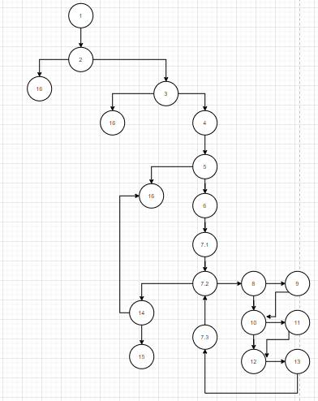

# SI_Lab2_183051

Група на код: Јас сум група број 4

*Control Flow Graph

*Цикломатска комплексност 

Број на ребра - број на јазли + 2 = 22 - 20 + 2 = 4

*Тест случаи според критериумот Every Statement

Јас направив вкупно 3 теста за да ги опфати сите услови 

Тест 1: listaKorisnici->korisnik1-> null;
Тест 2: listaKorisnici->korisnik2->(username:sangoky,password: razlicen!23,e-mail:martinshelby@outlook.com)
Тест 3: listaKorisnici->korisnik3->(username:sangoky,password:M123!456,e-mail:martinshelby@outlook.com)

*Тест случаи според критериумот Multiple Condition

За ова вкупно направив 4 теста.
Тест 1: listaVtora->korisnik4-> (username:null, password:dangev,e-mail:martin@outlook.com)
Тест 2: listaVtora->korisnik2->(username:maki567,password:null,e-mail:dangev123@yahoo.com)
Тест 3: listaVtora->korisnik3->(username:sangoky,password:M123!456,e-mail:martinshelby@outlook.com)
Tест 4: listaVtora->korisnik6->(username:sangoky,password:m123!456,e-mail:martinshelby@outlook.com)

*Објаснување на unit-tests

1)Every Statement:
a.За првиот тест праќаме null објект, не влага во првиот if- услов и програмата враќа false
b. За вториот тест праќам објект, кој ќе влезе во повеќето услови, но во циклусот има услов дали соддржи лозинката голема буква и тука нема да успее. Заради тоа враќа false програмата.
c. Третиот објект е со сите валидни вредности и програмата враќа true.

2)Multiple Condition
a. За овие тестови гледаме каде ќе оди објектот од условот. Така што за првиот имаме услов кој проверува дали имаме валидна лозинка и корисничко име, но бидејќи праќаме null-username, не влага.
b. За вториот тест исто праќаме објект за истиот услов, но овде проблемот е тоашто лозинката е null.
c. Третиот тест-пример има валидна лозинка и корисничко име и заради тоа имаме ТТ во условот и влага во условот.
d. Четвртиот тест-пример,условот проверува дали лозинката е иста со корисничкото име и дали лозинката е подолга или еднаква на 8 букви. Заради тоа што не е преминува во наредниот јазел.
